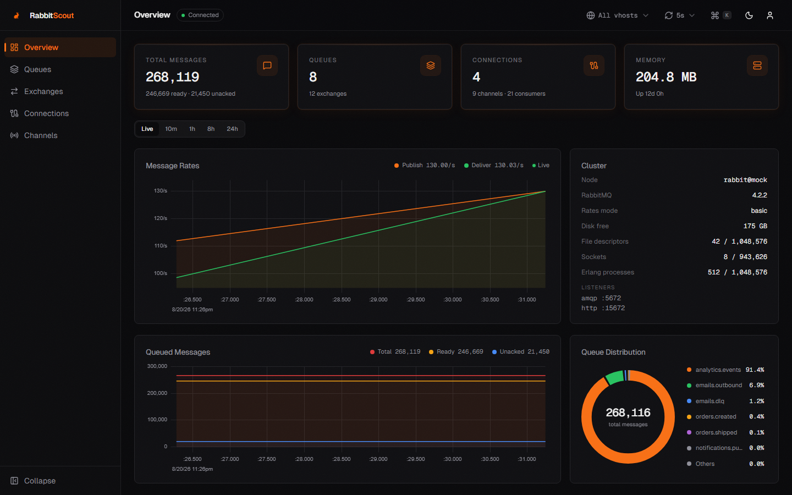
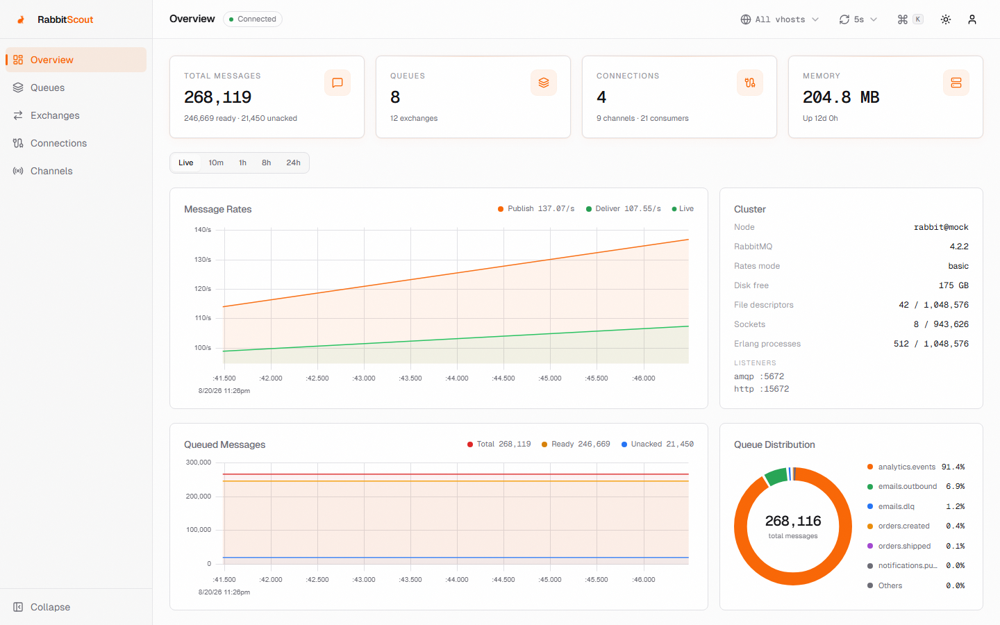
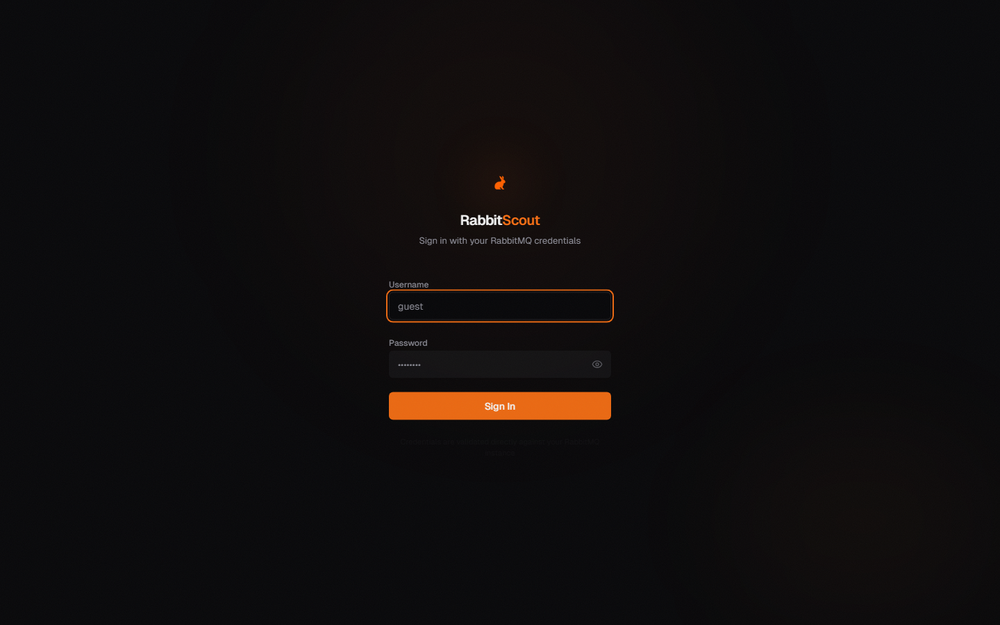

# RabbitScout

A modern, open-source dashboard for RabbitMQ management. Built as a clean alternative to the default RabbitMQ Management UI.




---

## Features

**Dashboard** — Real-time overview with canvas-rendered streaming charts, adjustable time ranges (Live / 10m / 1h / 8h / 24h backed by the broker's own sample history), queue distribution, cluster health with memory/disk alarms, and animated stats.

**Queues** — Create (classic, quorum, stream), inspect, and delete queues. A detail drawer shows per-queue rate history, consumers, and arguments. Peek messages with pagination and sorting, publish test messages with custom headers, purge with confirmation, delete with type-to-confirm.

**Exchanges** — Declare and delete exchanges, inspect bindings, and add new bindings to queues.

**Connections** — Monitor active connections with client-provided connection names, throughput metrics, and a detail drawer. Close connections when needed.

**Channels** — View channel state, prefetch counts, rates, and consumer counts.

**Command palette** — `Ctrl/⌘ K` to jump to any page or queue, toggle the theme, or pause live updates.

**Live-data controls** — Broker connection status in the header, a refresh-cadence picker (2s → 30s or paused), automatic pause while the tab is hidden, and a global vhost scope switcher.

**Auth** — Pass-through authentication. Each user logs in with their own RabbitMQ credentials. No server-side password storage. Works on RabbitMQ 3.x and 4.x.

**Theming** — Dark and light mode with a refined, minimal UI. Fully responsive, down to mobile.

---

## Quick Start

### Prerequisites

- Node.js 20.9+ (Node 24 LTS recommended)
- A running RabbitMQ instance with the [Management Plugin](https://www.rabbitmq.com/docs/management) enabled

### Install

```bash
git clone https://github.com/Ralve-org/RabbitScout.git
cd RabbitScout
npm install
```

### Configure

Create a `.env` file from the example:

```bash
cp .env.example .env
```

Edit `.env` with your RabbitMQ Management API connection:

```env
RABBITMQ_HOST=localhost
RABBITMQ_PORT=15672
RABBITMQ_PROTOCOL=http
```

That's it. No username or password in the config — users authenticate on the login page with their own RabbitMQ credentials.

### Run

```bash
# Development
npm run dev

# Production
npm run build && npm start
```

Open [http://localhost:3000](http://localhost:3000) and log in with your RabbitMQ credentials.

### Develop without a broker

A faithful mock of the RabbitMQ Management API (3.x and 4.x response shapes) ships with the repo:

```bash
npm run mock          # mock broker on :15672 (users: admin/admin, monitor/monitor, plain/plain)
npm run dev           # point RABBITMQ_PORT=15672 at it
```

---

## Docker

Pull the pre-built image (multi-arch: amd64 + arm64) from GitHub Container Registry:

```bash
docker run -p 3000:3000 \
  -e RABBITMQ_HOST=your-rabbitmq-host \
  -e RABBITMQ_PORT=15672 \
  -e RABBITMQ_PROTOCOL=http \
  ghcr.io/ralve-org/rabbitscout:latest
```

Or use Docker Compose:

```yaml
services:
  rabbitscout:
    image: ghcr.io/ralve-org/rabbitscout:latest
    ports:
      - "3000:3000"
    environment:
      - RABBITMQ_HOST=your-rabbitmq-host
      - RABBITMQ_PORT=15672
      - RABBITMQ_PROTOCOL=http
```

The image runs as a non-root user and includes a container `HEALTHCHECK` against `/api/health`.

### Build locally

```bash
docker build -t rabbitscout .
docker run -p 3000:3000 -e RABBITMQ_HOST=localhost -e RABBITMQ_PORT=15672 rabbitscout
```

---

## Environment Variables

| Variable | Required | Default | Description |
|---|---|---|---|
| `RABBITMQ_HOST` | Yes | `localhost` | RabbitMQ Management API hostname |
| `RABBITMQ_PORT` | No | `15672` | Management API port (omit for default/standard ports) |
| `RABBITMQ_PROTOCOL` | No | `http` | `http` or `https` |
| `RABBITMQ_API_TIMEOUT_MS` | No | `15000` | API request timeout in milliseconds |
| `COOKIE_SECURE` | No | auto | Force the session cookie's `Secure` attribute (`true`/`false`). By default it is detected per request, including `x-forwarded-proto` behind proxies |

---

## Screenshots

### Dark Mode


### Light Mode


### Login


---

## Tech Stack

- **Framework**: [Next.js 16](https://nextjs.org) (App Router, React 19, Turbopack)
- **Language**: TypeScript (strict mode)
- **UI**: [shadcn/ui](https://ui.shadcn.com)-style components on [Radix UI](https://www.radix-ui.com) + [Tailwind CSS v4](https://tailwindcss.com)
- **Charts**: [uPlot](https://github.com/leeoniya/uPlot) (canvas streaming + history) and a hand-rolled SVG donut — no chart mega-dependencies
- **Command palette**: [cmdk](https://cmdk.paco.me)
- **Animation**: [Motion](https://motion.dev)
- **State**: [Zustand](https://zustand-demo.pmnd.rs)
- **Icons**: [Lucide](https://lucide.dev)

---

## Project Structure

```
app/
  layout.tsx                      Server root layout with metadata
  (auth)/login/page.tsx           Login page
  (dashboard)/
    layout.tsx                    Responsive shell: sidebar, header, mobile nav
    page.tsx                      Overview dashboard with time ranges
    queues/page.tsx               Queue management
    exchanges/page.tsx            Exchange management
    connections/page.tsx          Connection management
    channels/page.tsx             Channel management
  api/
    auth/login/route.ts           POST — validate credentials, set session cookie
    auth/logout/route.ts          POST — clear session cookie
    auth/me/route.ts              GET — current session user (store rehydration)
    health/route.ts               GET — liveness probe for Docker/K8s
    publish/route.ts              POST — publish message (handles the default exchange)
    rabbitmq/[...path]/route.ts   Catch-all proxy to the RabbitMQ Management API

proxy.ts                          Auth gate: 401 JSON for APIs, login redirect for pages

lib/
  rabbitmq/                       API client, config, types, error classification
  auth/                           Session cookie helpers, client auth store
  stores/preferences.ts           Refresh cadence, vhost scope, density, sidebar

hooks/
  use-polling.ts                  Visibility-aware polling with abort + status reporting
  use-live-series.ts              Rolling window accumulation for live charts
  use-toast.ts                    Toast state

components/
  layout/                         Sidebar, header, command palette
  dashboard/                      Stat cards, streaming charts, donut, time ranges
  queues/                         Table, drawer, message viewer, publish/create/delete
  exchanges/                      Table, binding viewer + add-binding, create dialog
  connections/                    Table + detail drawer
  channels/                       Table
  shared/                         Table utilities, error boundary, error card
  ui/                             shadcn/ui-style primitives

scripts/
  mock-rabbitmq.mjs               Mock Management API (3.x / 4.x modes) for development
  e2e.mjs                         End-to-end test suite against the mock broker
```

---

## How Auth Works

RabbitScout uses **pass-through authentication**. When a user logs in, their credentials are validated directly against the RabbitMQ Management API (`/api/whoami`). On success, the credentials are stored in an httpOnly cookie and forwarded with every subsequent API request.

- No passwords are stored in environment variables or on disk
- Each user authenticates with their own RabbitMQ account
- Session expires after 24 hours
- All API calls are proxied through Next.js with the user's own credentials
- The cookie's `Secure` attribute is detected per request (`x-forwarded-proto` aware), so plain-HTTP deployments keep working sessions and HTTPS deployments stay strict

This means RabbitMQ's built-in permission system (management, monitoring, policymaker, administrator tags) is fully respected. User tags are parsed correctly on every supported broker: RabbitMQ ≤ 3.8 returns them as a comma-separated string, 3.9+ as an array — both work.

---

## Testing

```bash
npm run lint          # ESLint 9 (flat config)
npm run typecheck     # tsc --noEmit
npm run build         # production build
npm run e2e           # end-to-end suite against the bundled mock broker
```

The e2e suite covers the full auth surface (both broker tag formats, Secure-cookie behavior over HTTP and behind HTTPS proxies), the management proxy, publishing, and queue lifecycle.

---

## CI/CD

- **`ci.yml`** — lint, typecheck, build, and e2e on every pull request and push to `main`
- **`docker-publish.yml`** — builds and pushes a multi-arch (amd64/arm64) image to GHCR on pushes to `main` and version tags
- **Dependabot** — weekly grouped updates for npm, GitHub Actions, and the Docker base image

---

## Contributing

1. Fork the repository
2. Create a feature branch
3. Make your changes
4. Run `npm run lint && npm run typecheck && npm run build && npm run e2e`
5. Open a pull request

---

## License

MIT — see [LICENSE](LICENSE).
